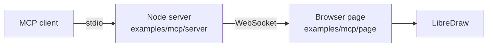

# Using LibreDraw from AI

Everything the toolbar can do is also a method on `LibreDraw`, so an AI agent (or any
program) can edit the map without pointer input. Two parts of the API make that practical
to automate:

- **Structured results.** `updateFeature`, `rotate`, `split`, `setback`, and `union` return
  an [`OperationResult`](/api/types#operationresult) instead of throwing for an expected
  operation failure (an unknown id, an invalid argument, or geometry that cannot be
  produced):
  `{ ok: true, created, updated, deleted }` on success, `{ ok: false, reason }` otherwise,
  and nothing on the map changes on a failure. `addFeatures` and `validateFeature` report
  per-feature outcomes the same way.
- **Event origin.** Every event carries `origin: 'api' | 'user'`, so a listener can tell an
  agent's changes from the user's own edits and, for example, avoid reacting to changes it
  caused itself.

```ts
const draw = new LibreDraw(map, { toolbar: false }); // toolbar-free; the map and the browser are still required

const result = draw.split('parcel', [
  [139.76, 35.6825],
  [139.774, 35.6865],
]);
if (!result.ok) console.warn(result.reason); // e.g. 'invalid-intersection-count'

draw.on('split', (e) => {
  if (e.origin === 'api') return; // our own call
  // ... a person split something with the split mode
});
```

## The reference MCP server

The repository ships a working bridge in
[`examples/mcp`](https://github.com/sindicum/libre-draw/tree/main/examples/mcp): a Node
MCP server (stdio transport) that exposes one tool per public method and relays each call
over a WebSocket to a browser page running LibreDraw. The `OperationResult` of every
operation is returned to the agent unchanged, and the page's log panel shows each event
with its `origin`.



It is demo code that you run locally: the server binds to `127.0.0.1` and talks to a map
page you start from the repository with `npx vite examples/mcp`. The hosted demos on this
site are not connected to it.

MCP-specific code lives only in the example: the library itself does not depend on any
AI protocol, and the same methods serve both people and agents. See the example's README
for setup, the tool list, and the "split this parcel along the road" walkthrough.

## In production

LibreDraw always runs in a browser, next to a MapLibre map, so wiring an agent to it in a
real deployment is a question of routing: which user's page should a call reach, and who
is allowed to make it. The example answers neither (stdio, one page, localhost, no
authentication), so treat it as a proof of the contract rather than a deployment template.

What carries over unchanged:

- **The tool definitions** (`server/tools.ts`): names, descriptions, and argument shapes,
  one per public method. They work as MCP tools, and the same names, descriptions, and
  argument shapes can be adapted to the tool definition format of a direct LLM tool-use
  call.
- **The page-side dispatch** (`page/dispatch.ts`): tool name to `draw.xxx(...)`, with thrown
  `LibreDrawError`s turned into `{ ok: false, reason }`.
- **The broker pattern** (`server/bridge-host.ts`): request ids, a timeout per call, and an
  immediate `{ ok: false, reason: 'no-client' }` when no page is attached. Keep one broker
  per user session instead of one for the process.
- **The contract**: pass `OperationResult` through untouched, let the agent read `reason`
  and retry, and use `origin: 'api'` to show, log, or gate the agent's changes.

What to replace:

- **Transport.** For a remote or shared MCP service, use MCP's Streamable HTTP instead of
  stdio so the server can be a long-running service that several clients reach. stdio
  remains fine for a server that runs next to a single local client.
- **Authentication and routing.** Authenticate the MCP client (for example OAuth), identify
  the page through your application's own login session, and route each call to that
  session's socket. Do not rely on a single-connection server.
- **Channel.** Use `wss://` with an `Origin` allowlist for your own domain; drop the
  loopback-only binding.
- **Confirmation.** Consider not committing an agent's change immediately: show it (the
  `origin: 'api'` event is the hook), or preview and validate before the user confirms.

If the agent's tool loop runs in the same browser page as LibreDraw, rather than in an
external MCP client, the bridge is not needed: call the LLM with tool use from that page
and implement each tool as a direct call on the `LibreDraw` instance. Running LibreDraw, or its geometry operations,
without a map on the server is not supported.
