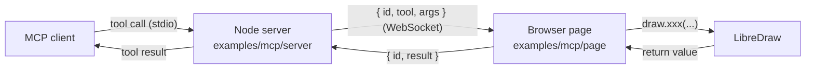

# Programmatic API

Everything the toolbar does is also a method on `LibreDraw`, so a program can take part in
a map that a person is editing: an application script, a sync loop, or an AI agent driving
the same page. The API is made for that setting, where a person sees the map and the
changes on it. Batch work that nobody watches (reprojecting a dataset, splitting ten
thousand parcels overnight) belongs on the server, writing to your database; use
LibreDraw for the map people edit.

LibreDraw always runs in a browser, next to a MapLibre map. Running it, or its geometry
operations, without a map on the server is not supported.

Two parts of the API make it a contract a program can rely on:

- **Structured results.** A method that takes data answers with a value, never with an
  exception: [`OperationResult`](/api/types#operationresult) for the operations,
  [`AddFeatureResult[]`](/api/types#addfeatureresult) for `addFeatures`, and
  [`FeatureValidationResult`](/api/types#featurevalidationresult) for `validateFeature`.
  See [Return values and exceptions](#return-values-and-exceptions).
- **Event origin.** Every event carries `origin: 'api' | 'user'`, so a listener can tell
  a program's changes from the person's own edits. See [Event origin](#event-origin).

## Return values and exceptions

`LibreDraw` throws a [`LibreDrawError`](/api/types#libredrawerror) only for misuse of the
instance: a call after `destroy()`, a mode name that does not exist, or an unsupported
`locale` in the constructor. Everything about the data you pass (an unknown id, an invalid
geometry, a line that misses the polygon) comes back in the return value. Argument _types_
are TypeScript's job: the library does not check them at runtime, and `split(id, undefined)`
fails with an ordinary `TypeError` like any JavaScript call.

Every method except `destroy()` throws `LibreDrawError` once the instance is destroyed;
the table leaves that out.

| Method                              | Returns                                                         | Throws            | Notes                                                                                                                                               |
| ----------------------------------- | --------------------------------------------------------------- | ----------------- | --------------------------------------------------------------------------------------------------------------------------------------------------- |
| `setMode(mode)`                     | `void`                                                          | Unknown mode name | Emits `modechange`. Nothing changes when it throws.                                                                                                 |
| `getMode()`                         | [`ModeName`](/api/types#modename)                               | never             |                                                                                                                                                     |
| `setInputMethod(method)`            | `void`                                                          | Unknown method    | `'tap'` or `'reticle'`. Keeps the draft. Nothing changes when it throws.                                                                            |
| `getInputMethod()`                  | [`InputMethod`](/api/types#inputmethod)                         | never             |                                                                                                                                                     |
| `getFeatures()`                     | [`LibreDrawFeature[]`](/api/types#libredrawfeature)             | never             |                                                                                                                                                     |
| `toGeoJSON()`                       | [`FeatureCollection`](/api/types#featurecollection)             | never             |                                                                                                                                                     |
| `setFeatures(geojson)`              | [`OperationResult`](/api/types#operationresult)                 | never             | All or nothing. `created` is the new set, `deleted` the previous one. Resets history and selection; emits no `create` / `delete`.                   |
| `addFeatures(features)`             | [`AddFeatureResult[]`](/api/types#addfeatureresult)             | never             | One entry per input, in order. Valid entries are added as one undo step; invalid ones (bad geometry, duplicate id) carry a `reason`.                |
| `validateFeature(feature)`          | [`FeatureValidationResult`](/api/types#featurevalidationresult) | never             | Checks the Feature only (envelope, geometry type, coordinate range, ring closure, self-intersection). Does not check duplicate ids.                 |
| `getFeatureById(id)`                | `LibreDrawFeature \| undefined`                                 | never             |                                                                                                                                                     |
| `deleteFeature(id)`                 | `LibreDrawFeature \| undefined`                                 | never             | `undefined` for an unknown id: nothing recorded, no event.                                                                                          |
| `updateFeature(id, patch)`          | `OperationResult`                                               | never             | `not-found`, `geometry-type-mismatch`, `empty-patch`, or a validation message.                                                                      |
| `rotate(id, angleDeg)`              | `OperationResult`                                               | never             | `not-found`, `not-rotatable`, `no-rotation`, or a validation message.                                                                               |
| `split(id, line)`                   | `OperationResult`                                               | never             | `not-found`, `not-splittable`, or a [`SplitFailReason`](/api/events#splitfailed) (also emits `splitfailed`).                                        |
| `setback(id, edge, distanceMeters)` | `OperationResult`                                               | never             | `not-found`, `not-polygon`, `invalid-edge`, `invalid-distance`, or a [`SetbackFailReason`](/api/events#setbackfailed) (also emits `setbackfailed`). |
| `union(ids)`                        | `OperationResult`                                               | never             | `unsupported-count`, `not-found`, or a [`UnionFailReason`](/api/events#unionfailed) (also emits `unionfailed`).                                     |
| `cut(id, cutter)`                   | `OperationResult`                                               | never             | `not-found`, `not-polygon`, `invalid-cutter`, or a [`CutFailReason`](/api/events#cutfailed) (also emits `cutfailed`).                               |
| `selectFeature(id)`                 | `boolean`                                                       | never             | `false` for an unknown id: mode and selection unchanged, no event.                                                                                  |
| `selectFeatures(ids)`               | `boolean`                                                       | never             | `false` for an empty list or any unknown id: mode and selection unchanged, no event.                                                                |
| `getSelectedFeatureIds()`           | `string[]`                                                      | never             |                                                                                                                                                     |
| `clearSelection()`                  | `void`                                                          | never             |                                                                                                                                                     |
| `finishDrawing()`                   | `boolean`                                                       | never             | `false` outside a drawing mode, with too few vertices, or when closing the ring would self-intersect.                                               |
| `cancelDrawing()`                   | `void`                                                          | never             | No-op outside a drawing mode.                                                                                                                       |
| `getDraftVertexCount()`             | `number`                                                        | never             |                                                                                                                                                     |
| `undoLastVertex()`                  | `boolean`                                                       | never             | `false` outside a drawing mode with a draft, or when the draft is empty.                                                                            |
| `setStyle(style)` / `getStyle()`    | `void` / [`StyleConfig`](/api/types#styleconfig)                | never             |                                                                                                                                                     |
| `undo()` / `redo()`                 | `boolean`                                                       | never             | `false` when there is nothing to undo / redo.                                                                                                       |
| `on()` / `off()`                    | `void`                                                          | never             |                                                                                                                                                     |
| `destroy()`                         | `void`                                                          | never             | Idempotent.                                                                                                                                         |

The failure codes of each operation are listed on the [Types](/api/types#operation-result-types)
page.

## Event origin

Every event payload carries `origin`. It is decided by the call path, not by the kind of
change:

| What happened                                                                                               | `origin`                                                                                            |
| ----------------------------------------------------------------------------------------------------------- | --------------------------------------------------------------------------------------------------- |
| The person used the toolbar, the pointer, touch, or a key (Delete, Escape)                                  | `'user'`                                                                                            |
| Your code called a public method                                                                            | `'api'`                                                                                             |
| The person pressed Undo / Redo (the button or Ctrl+Z / Ctrl+Shift+Z / Ctrl+Y), even to revert an API change | `'user'`                                                                                            |
| Your code called `undo()` / `redo()`, even to revert the person's edit                                      | `'api'`                                                                                             |
| Your code called a public method from inside a `'user'` event listener                                      | The nested call's own events are `'api'`; the remaining events of the person's action stay `'user'` |
| Your code called `finishDrawing()` on a draft the person was drawing                                        | `'api'`                                                                                             |

The value says who triggered the change, not whose change is being undone. Use it to keep a
sync loop from echoing its own writes:

```ts
draw.on('delete', (e) => {
  if (e.origin === 'api') return; // our own call
  api.deleteParcel(e.feature.id); // the person's change
});
```

## Using it from an AI agent

An agent is one more program: give it the methods as tools, pass the arguments through, and
hand the return value back untouched. When an operation answers `{ ok: false, reason }`
nothing on the map has changed, so the agent reads `reason` and retries. (`addFeatures` is
per feature: the valid entries of a call are added even when others are rejected.)

```ts
const draw = new LibreDraw(map, { toolbar: false }); // toolbar-free; the map and the browser are still required

const result = draw.split('parcel', [
  [139.76, 35.6825],
  [139.774, 35.6865],
]);
if (!result.ok) console.warn(result.reason); // e.g. 'invalid-intersection-count'

draw.on('split', (e) => {
  if (e.origin === 'api') return; // the agent's call
  // ... a person split something with the split mode
});
```

Three things to know before wiring one up:

- **Changes are immediate.** A successful operation is on the map, in the history, and
  reported to listeners before the call returns. There is no staging area, so you cannot
  hold an agent's change back for a preview and commit it later.
- **Pre-checks cover the Feature, not the operation.** `validateFeature` tells you whether a
  Feature's shape would be accepted by `addFeatures`, `setFeatures`, or as an `updateFeature`
  patch; it does not check ids, so pair it with `getFeatureById` when a duplicate would
  matter. Whether a split line crosses the polygon exactly twice, or two polygons touch, is
  only known by running the operation; the result says so.
- **Rejecting is `undo()`, and it reverts the latest step whoever made it.** Use it only when
  you know no other change happened since: watch for `origin: 'user'` events in between.
  There is no public method that reads the top of the history.

## The reference MCP server

The repository ships a working bridge in
[`examples/mcp`](https://github.com/sindicum/libre-draw/tree/main/examples/mcp): a Node
MCP server (stdio transport) that exposes the methods an agent needs as tools (reading,
adding, updating, deleting, the five operations, selecting, undo / redo) and relays each
call over a WebSocket to a browser page running LibreDraw. An `OperationResult` and an
`AddFeatureResult[]` are passed back to the agent unchanged; the page maps the `boolean` of
`selectFeature` onto `{ ok, reason }` and the `undefined` of `getFeatureById` /
`deleteFeature` onto `null` so every result is JSON. The page's log panel shows each event
with its `origin`.



Events do not travel this way. The page only answers requests, so a change the person makes
with the toolbar shows up in the log panel (with `origin: 'user'`) but never reaches the MCP
client. An agent that needs the current state reads it again with `get_features` or
`get_feature` before acting.

It is demo code that you run locally: the server binds to `127.0.0.1` and talks to a map
page you start from the repository with `npx vite examples/mcp`. The hosted demos on this
site are not connected to it.

MCP-specific code lives only in the example: the library itself does not depend on any
AI protocol, and the same methods serve both people and agents. See the example's README
for setup, the tool list, and the "split this parcel along the road" walkthrough.

## In production

LibreDraw always runs in a browser, next to a MapLibre map, so wiring an agent to it in a
real deployment is a question of routing: which user's page should a call reach, and who
is allowed to make it. The example answers neither (stdio, one page, localhost, no
authentication), so treat it as a proof of the contract rather than a deployment template.

What carries over unchanged:

- **The tool definitions** (`server/tools.ts`): names, descriptions, and argument shapes,
  one per public method. They work as MCP tools, and the same names, descriptions, and
  argument shapes can be adapted to the tool definition format of a direct LLM tool-use
  call.
- **The page-side dispatch** (`page/dispatch.ts`): tool name to `draw.xxx(...)`, with the
  `boolean` of `selectFeature` mapped onto `{ ok, reason }` and a catch for instance misuse.
- **The broker pattern** (`server/bridge-host.ts`): request ids, a timeout per call, and an
  immediate `{ ok: false, reason: 'no-client' }` when no page is attached. Keep one broker
  per user session instead of one for the process.
- **The contract**: pass the return values through untouched, let the agent read `reason`
  and retry, and use `origin: 'api'` to show, log, or gate the agent's changes.

What to replace:

- **Transport.** For a remote or shared MCP service, use MCP's Streamable HTTP instead of
  stdio so the server can be a long-running service that several clients reach. stdio
  remains fine for a server that runs next to a single local client.
- **Authentication and routing.** Authenticate the MCP client (for example OAuth), identify
  the page through your application's own login session, and route each call to that
  session's socket. Do not rely on a single-connection server.
- **Channel.** Use `wss://` with an `Origin` allowlist for your own domain; drop the
  loopback-only binding.
- **Confirmation.** An agent's change is on the map as soon as the call returns; there is
  no preview step in the library. To let the person accept or reject it, show it (the
  `origin: 'api'` event is the hook) and offer an undo: `undo()` reverts the latest step, so
  offer it only while no `origin: 'user'` event has arrived since. For a real approval flow,
  keep the agent's proposal in your own state and call LibreDraw once the person accepts.

If the agent's tool loop runs in the same browser page as LibreDraw, rather than in an
external MCP client, the bridge is not needed: call the LLM with tool use from that page
and implement each tool as a direct call on the `LibreDraw` instance.
